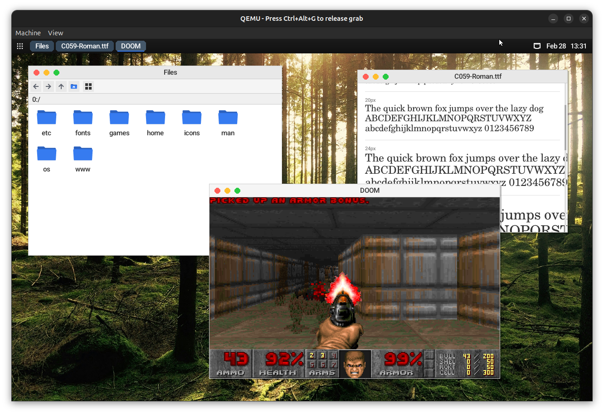

# The Montauk Operating System
MontaukOS is a hobbyist operating system written in modern C++. It runs on bare metal and supports various applications, including DOOM, a Wikipedia client, and standard desktop utilities.

## Features
* Modern preemptive multitasking kernel
* Userspace with desktop environment and command line
* PCI-e support and drivers for Intel GPU and e100e Ethernet for graphics and networking on real hardware
* Support for USB including input devices (keyboard/mouse), along with PS/2 input support
* VFS using numbered drive identifiers with ramdisk support
* Support for UEFI Runtime Services, including power management calls (shutdown/reboot)
* Customizable desktop environment with 12+ graphical apps, including a terminal emulator, file manager, Wikipedia client, weather app, DOOM, and more
* Modern icon pack (Flat Remix) used in desktop environment
* Support for TrueType font, JPEG image, and SVG icon rendering
* Networking including TCP/IP stack, UDP, DNS, DHCP and TLS via BearSSL
* Command-line IRC client
* Live viewable kernel log from GUI
* Mandelbrot set renderer