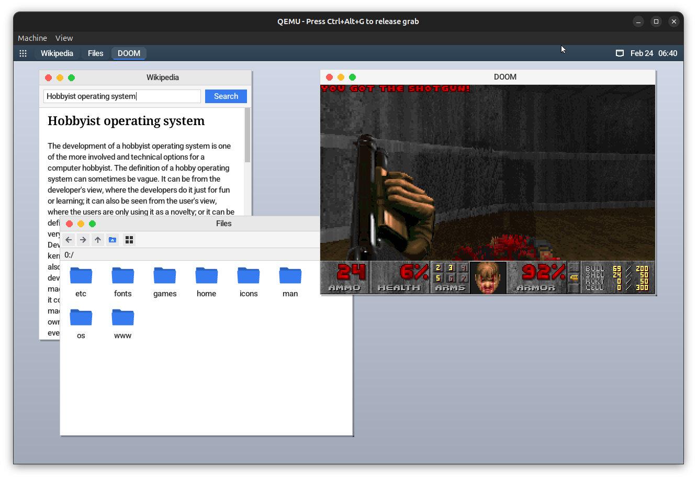

# The ZenithOS Operating System
ZenithOS is a hobbyist operating system written in modern C++. It runs on bare metal and supports various applications, including DOOM, a Wikipedia client, and standard desktop utilities.

